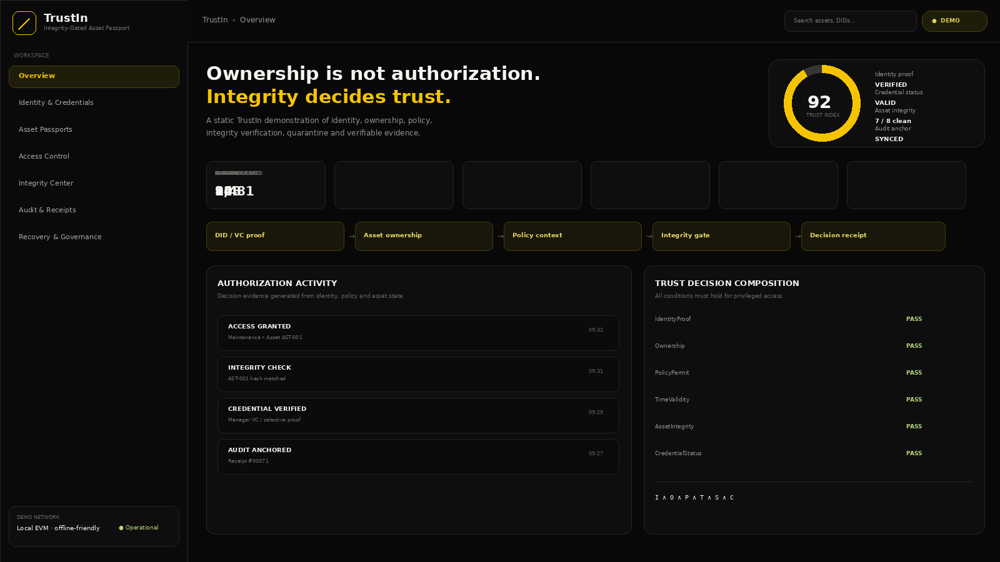
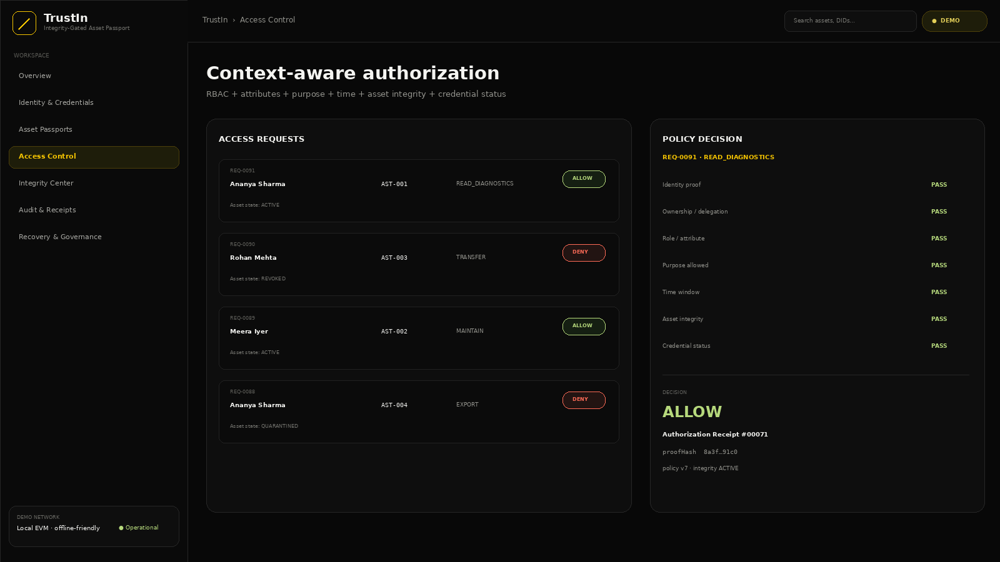
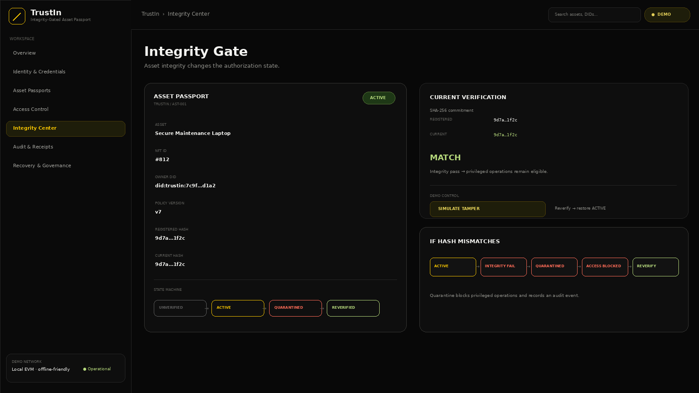
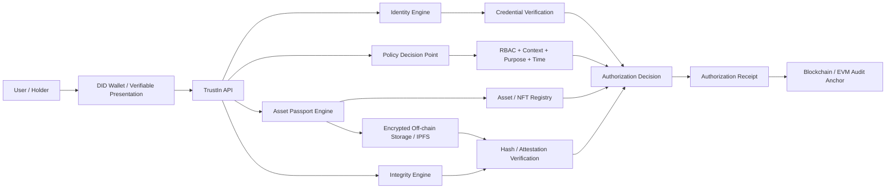
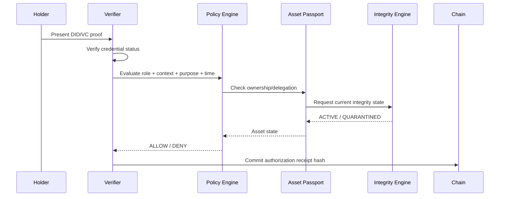
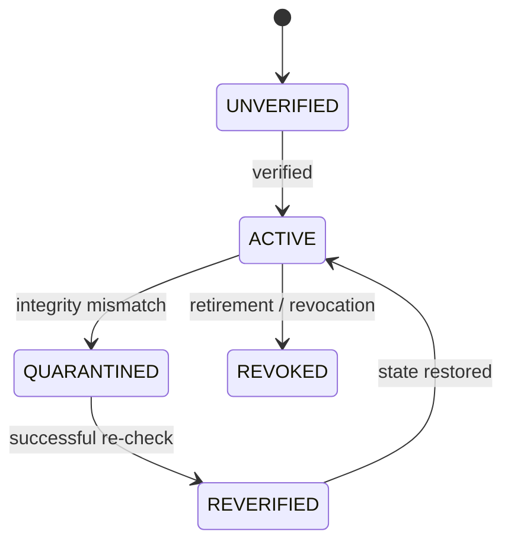

# TrustIn — Integrity-Gated Asset Passport (IGAP)

> **Smart India Hackathon 2026 · Problem Statement 26125**  
> **Problem:** Blockchain-Based Secure Platform for Identity, Access Control & Digital Asset Management   
> **Status:** 🚧 **In Development**

TrustIn is a research-backed, open-source-first architecture for connecting **decentralized identity, digital-asset ownership, contextual authorization and asset integrity** into one verifiable trust decision.

The central design principle is:

> **Ownership ≠ Authorization ≠ Integrity**

An asset can have a valid owner and still be unsafe or unauthorised to use. TrustIn therefore gives each asset an **Integrity-Gated Asset Passport (IGAP)** containing its ownership reference, policy context, integrity state and audit evidence.

---

## 1. Why TrustIn is relevant to PS 26125

PS 26125 calls for a blockchain-based platform that combines decentralized identity, cryptographic proofs, NFT-based asset ownership, smart-contract-governed RBAC, controlled asset operations and an immutable audit trail.

TrustIn directly maps these requirements into one architecture:

| PS 26125 requirement | TrustIn implementation/design |
|---|---|
| Decentralized identifiers | DID/VC identity layer |
| Cryptographic identity proofs | Verifiable presentations + planned privacy predicate |
| Digital asset representation | NFT-backed Asset Passport |
| Identity ↔ asset ownership | Owner DID bound to asset passport |
| Controlled minting/allocation | Role-restricted smart-contract functions |
| RBAC | Admin / Manager / Auditor / User role model |
| Access-right enforcement | Policy Decision Point + smart contracts |
| Ownership / transfer history | Asset registry + audit events |
| Tamper-evident records | On-chain commitment / receipt hashes |
| Asset authenticity / integrity | Registered asset commitment + verification |
| Unified trust view | Identity + ownership + policy + integrity + evidence |
| Transparent audit trail | Authorization receipts and audit registry |

The official problem statement explicitly asks for decentralized identity, NFT ownership, smart-contract controls, RBAC and immutable records. TrustIn extends that baseline by making **current asset integrity an explicit authorization condition**. fileciteturn3file0L1-L4

---

## 2. The core innovation

### Integrity-Gated Asset Passport

Instead of treating an NFT as a complete trust signal:

```text
NFT ownership
      ↓
"Owner is valid"
```

TrustIn evaluates:

```text
DID / VC
   +
Ownership / Delegation
   +
Policy / Role / Purpose / Time
   +
Asset Integrity
   +
Credential Status
   ↓
ALLOW / DENY
   ↓
Authorization Receipt
```

### Asset state machine

```text
UNVERIFIED
     │
     │ verification succeeds
     ▼
   ACTIVE
     │
     │ integrity mismatch
     ▼
QUARANTINED
     │
     │ re-verification
     ▼
REVERIFIED ───────► ACTIVE
```

When an integrity mismatch occurs, TrustIn can block privileged operations until the asset is reverified.

### Why this matters

The research/build analysis deliberately avoided presenting DID + NFT + RBAC alone as a new invention. The project is positioned as an **integration and research-gap architecture** connecting identity, asset ownership, privacy-aware authorization, integrity state and verifiable decision evidence. The project does **not** claim to be the world's first implementation. fileciteturn3file1L5-L41

---

## 3. What is actually implemented today

The repository intentionally separates the **working demonstration** from the **production architecture still being implemented**.

| Layer | Current status |
|---|---|
| `index.html` TrustIn dashboard | ✅ Working static demo |
| Asset Passport UI | ✅ Demonstrated |
| Access-control decision UI | ✅ Demonstrated |
| Integrity tamper → quarantine interaction | ✅ Demonstrated |
| Reverification → ACTIVE interaction | ✅ Demonstrated |
| Audit / authorization-receipt UI | ✅ Demonstrated |
| DID / VC flow | 🟡 UI simulation |
| ZK proof generation | 🔴 In Development |
| Live DID/VC cryptography | 🔴 In Development |
| Solidity contracts | 🔴 In Development |
| Live EVM settlement | 🔴 In Development |
| OPA/Rego production PDP | 🔴 In Development |
| IPFS persistence | 🔴 In Development |
| PostgreSQL persistence | 🔴 In Development |
| Physical-device attestation | 🔴 In Development |
| Recovery / multisig workflows | 🔴 In Development |
| Security/invariant test suite | 🔴 In Development |

This distinction is intentional. The HTML demo is designed for idea/prototype presentation; it does **not** falsely imply that blockchain transactions, ZK proofs or DID cryptography are already running behind the interface.

---

# 4. Try the prototype

The quickest judge-facing path is:

```text
Open index.html
      ↓
Overview
      ↓
Integrity Center
      ↓
Simulate Tamper
      ↓
ACTIVE → QUARANTINED
      ↓
Access Control
      ↓
Privileged request → DENIED
      ↓
Audit & Receipts
      ↓
Evidence recorded
      ↓
Integrity Center → Reverify
      ↓
ACTIVE restored
```

### Offline demo

No backend, npm installation, API key or blockchain node is required for the current demonstration.

Open:

```text
index.html
```

or:

```text
demo/index.html
```

---

# 5. Prototype screenshots

## TrustIn Command Center



The dashboard exposes the project’s central trust model rather than showing a generic blockchain dashboard.

## Access Control



The access view demonstrates a contextual authorization decision based on identity, credential status, role/policy, ownership and asset state.

## Integrity Center



The integrity view demonstrates the key innovation path: integrity failure changes the asset state and can block privileged actions.

---

# 6. System architecture



### Trust decision

```text
Access =
IdentityProof
 ∧ Ownership/Delegation
 ∧ PolicyPermit
 ∧ TimeValidity
 ∧ AssetIntegrity
 ∧ CredentialStatus
```

The design separates large/sensitive off-chain data from on-chain commitments. The proposed technology stack uses W3C DID/VC, Solidity/OpenZeppelin, OPA/Rego, PostgreSQL, IPFS/Kubo and optional ZK tooling. fileciteturn3file2L124-L136

---

# 7. Authorization sequence



---

# 8. Integrity-gated state machine



### Integrity rule

```text
Hcurrent = SHA-256(current asset representation)

Hcurrent == Hregistered
        ├── YES → ACTIVE
        └── NO  → QUARANTINED
```

The integrity mechanism is a design extension of the research gap documented in the project analysis: NFT ownership does not automatically prove that the referenced asset is still accessible, authentic or unchanged. The project therefore treats integrity as a separate trust condition. fileciteturn3file1L7-L17

---

# 9. Authorization receipt

A successful decision is designed to produce a compact evidence object:

```json
{
  "subjectDIDHash": "…",
  "assetId": "AST-001",
  "action": "READ_DIAGNOSTICS",
  "purposeHash": "…",
  "policyVersion": 7,
  "credentialStatus": "VALID",
  "integrityStatus": "ACTIVE",
  "decision": "ALLOW",
  "timestamp": "…",
  "proofHash": "…"
}
```

A future on-chain implementation will anchor the receipt hash rather than placing sensitive identity data or large asset files directly on-chain.

---

# 10. Technology architecture

The repository follows an open-source-first structure.

### Frontend

- React
- Vite
- TypeScript

### Backend

- Node.js
- NestJS or Express
- OPA / Rego

### Blockchain

- Solidity
- OpenZeppelin Contracts
- Foundry / Anvil
- EVM-compatible network

### Identity

- W3C DID Core
- W3C Verifiable Credentials
- SpruceID SSI or current walt.id identity components

### Storage

- PostgreSQL
- IPFS / Kubo
- encrypted off-chain object storage

### Privacy

- Noir or Circom + snarkjs
- selective-disclosure / ZK predicate

### Security / DevOps

- Slither
- Echidna
- unit/invariant tests
- Docker
- GitHub Actions

These technologies correspond to the open-source stack specified in the repository architecture. fileciteturn3file2L124-L136

---

# 11. Repository structure

```text
TrustIn/
│
├── index.html                         # ✅ Working offline demo
├── demo/
│   └── index.html                     # Demo copy
│
├── apps/
│   ├── web/                           # 🚧 React production UI
│   │   └── src/
│   │       ├── pages/
│   │       ├── components/
│   │       ├── hooks/
│   │       └── lib/
│   │
│   └── api/                           # 🚧 Node API
│       └── src/
│           ├── modules/
│           │   ├── identity/
│           │   ├── assets/
│           │   ├── authorization/
│           │   ├── integrity/
│           │   ├── audit/
│           │   └── recovery/
│           └── common/
│
├── contracts/                         # 🚧 Solidity layer
│   ├── src/
│   ├── script/
│   └── test/
│
├── identity/                          # 🚧 DID / VC adapters
│   ├── schemas/
│   ├── issuers/
│   └── verifiers/
│
├── policy/                            # 🚧 OPA/Rego
│   ├── rego/
│   └── examples/
│
├── integrity/                         # 🚧 Integrity engine
│   ├── hashing/
│   ├── attestations/
│   ├── state-machine/
│   └── fixtures/
│
├── zk/                                # 🚧 Privacy layer
│   ├── circuits/
│   ├── prover/
│   └── verifier/
│
├── storage/                           # 🚧 Persistence
│   ├── ipfs/
│   ├── encryption/
│   └── migrations/
│
├── packages/
│   ├── schemas/
│   ├── crypto/
│   └── sdk/
│
├── tests/
│   ├── integration/
│   ├── security/
│   └── fixtures/
│
├── scripts/
│   ├── local-dev/
│   ├── seed/
│   └── verify/
│
├── infra/
│   ├── docker/
│   ├── compose/
│   └── local-chain/
│
├── docs/
│   ├── architecture/
│   ├── threat-model/
│   ├── research/
│   ├── api/
│   ├── deployment/
│   └── assets/
│
├── .github/workflows/
├── .env.example
├── SECURITY.md
├── CONTRIBUTING.md
└── LICENSE
```

This follows the repository structure previously defined for TrustIn, including identity, asset, authorization, integrity, audit, recovery, ZK, storage, policy and infrastructure boundaries. fileciteturn3file2L6-L110

---

# 12. Smart-contract boundary

The planned contract layer is intentionally separated into responsibilities:

```text
IdentityRegistry
CredentialRegistry
AssetRegistry
AccessPolicy
AuthorizationManager
AuditRegistry
RecoveryManager
```

The goal is to avoid a single monolithic contract and to keep privileges separated.

Example role model:

```text
ADMIN
 ├── policy administration
 └── governance

MINTER
 └── controlled asset minting

ASSET_MANAGER
 └── allocation / transfer workflows

AUDITOR
 └── evidence / audit inspection

RECOVERY_GUARDIAN
 └── recovery workflow
```

The contract layer is **In Development** and is not presented as a deployed production system.

---

# 13. Policy model

TrustIn is designed to move beyond static RBAC by evaluating contextual conditions:

```text
ROLE
+
ASSET
+
ACTION
+
PURPOSE
+
TIME
+
CREDENTIAL STATUS
+
ASSET INTEGRITY
```

Example:

```text
Manager
+
Asset AST-001
+
READ_DIAGNOSTICS
+
maintenance purpose
+
valid time window
+
valid credential
+
ACTIVE asset
=
ALLOW
```

But:

```text
Manager
+
same asset
+
same role
+
integrity = QUARANTINED
=
DENY
```

The RBAC layer required by PS 26125 therefore remains present, while contextual authorization is added around it.

---

# 14. Privacy model

TrustIn is designed to avoid placing unnecessary PII on-chain.

```text
Sensitive:
    employee ID
    department
    full credentials
    asset files
    private metadata

        ↓

Encrypted / Off-chain

        ↓

On-chain:
    ownership reference
    policy version
    status
    hashes / commitments
    authorization evidence
```

The planned privacy layer can allow a holder to prove a predicate such as:

```text
role >= AUDITOR
```

without disclosing every underlying attribute.

ZK is intentionally modular and listed as **In Development**, rather than pretending the static HTML demo already generates live zero-knowledge proofs.

---

# 15. Failure handling & recovery

TrustIn explicitly designs around the failure points identified during the research/build analysis.

| Failure | Planned recovery |
|---|---|
| Private-key loss / compromise | 2-of-3 or 3-of-5 recovery + rotation |
| Off-chain asset unavailable | redundant pinning + encrypted backup + on-chain hash |
| Credential revoked/expired | verify status at decision time |
| Admin abuse / policy drift | least privilege + separated roles + multisig governance |
| ZK complexity | staged implementation from VC verification → one predicate → expansion |
| Legacy IAM integration | adapter layer + phased migration |

These are part of the feasibility strategy used in the SIH deck. fileciteturn3file1L27-L40

---

# 16. Development roadmap

### Phase 1 — Foundation

- DID/VC adapter
- Asset registry
- NFT ownership model
- roles
- basic authorization receipt

### Phase 2 — Integrity Gate

- asset commitment
- SHA-256 verification
- state machine
- quarantine transition
- access blocking

### Phase 3 — Privacy

- one ZK predicate
- selective proof verification
- policy privacy

### Phase 4 — Enterprise Hardening

- recovery
- multisig
- IPFS persistence
- legacy IAM adapter
- security and invariant tests

This staged plan matches the project's feasibility strategy and keeps the high-risk ZK layer from becoming a dependency for the baseline path. fileciteturn3file1L27-L39

---

# 17. Research basis

The project is grounded in the research set carried into the SIH submission:

1. **Wang, Gao & Wei — NFT-to-asset connection fragility**, WWW 2023  
   DOI: `10.1145/3543507.3583281`

2. **Hasan et al. — NFTs for digital twins & physical-asset proof of delivery**, FGCS 2023  
   DOI: `10.1016/j.future.2023.03.047`

3. **Di Francesco Maesa et al. — SSI + blockchain access control + ZK**, JNCA 2023  
   DOI: `10.1016/j.jnca.2022.103577`

4. **Hidden-policy blockchain access control + ZK**, FGCS 2023  
   DOI: `10.1016/j.future.2022.11.006`

5. **Zero trust-driven access-control delegation using blockchain**, 2026 issue  
   DOI: `10.1016/j.bcra.2025.100319`

6. **Akaichi & Kirrane — usage control review**, Computer Science Review 2025  
   DOI: `10.1016/j.cosrev.2024.100698`

7. **Elmay et al. — digital twins + dynamic NFTs for integrity**, IPM 2024  
   DOI: `10.1016/j.ipm.2024.103756`

8. **Mariniello et al. — SHERPA blockchain/IPFS asset-data governance**, Automation in Construction 2025  
   DOI: `10.1016/j.autcon.2025.106558`

The project uses these works to support the research gap and design direction; it does not claim that each individual component is novel. The 35-point review explicitly classifies what is a core innovation versus established background technology. fileciteturn3file1L5-L40

---

# 18. Existing/open solutions used as reference points

TrustIn does not attempt to pretend established components are inventions.

| Reference | Studied for |
|---|---|
| Microsoft Entra Verified ID | DID / VC identity workflows |
| walt.id | open SSI / DID / VC tooling |
| SpruceID SSI | credential and cryptographic infrastructure |
| OpenZeppelin | secure contract access control |
| RWAccess | blockchain-backed physical access |
| ZK-PEAC | privacy-preserving authorization research |

These are reference implementations / dependencies, not claims of ownership by TrustIn.

---

# 19. What makes TrustIn different

The key design distinction is the **relationship between the layers**:

```text
Traditional decomposition

Identity ────────┐
Ownership ───────┤
RBAC ────────────┤ → separate controls
Audit ───────────┘


TrustIn

DID / VC
   │
   ▼
Asset Passport
   │
   ├── Ownership
   ├── Policy
   ├── Integrity state
   └── Delegation
   │
   ▼
Authorization Decision
   │
   ├── ALLOW
   └── DENY
   │
   ▼
Verifiable Authorization Receipt
```

The proposed research-gap position is:

> **Ownership ≠ Authorization ≠ Integrity**

and:

> **Integrity failure changes the authorization state.**

That is the conceptual center of TrustIn.

---

# 20. Scope and honesty

TrustIn is currently **In Development**.

The repository contains:

- a working, self-contained static demonstration;
- the intended production repository architecture;
- contract/API/policy/identity boundaries;
- research documentation;
- security/recovery design;
- implementation roadmap.

The following should **not** be interpreted as already deployed merely because the interfaces exist:

- live blockchain transactions;
- production DID resolution;
- real ZK proving;
- production-grade key custody;
- hardware attestation;
- distributed IPFS persistence;
- production authentication;
- completed smart-contract audit.

Those components are clearly marked `In Development` in the source tree.

---

# 21. Current demo entry point

### Zero-setup

```bash
# Option 1: double-click index.html

# Option 2: local server
python -m http.server 8080
```

Then open:

```text
http://localhost:8080/
```

No internet dependency is required for the current demo.

---

# 22. Planned local development

Once the production layers are implemented:

```bash
# install dependencies
npm install

# start local EVM
anvil

# start policy engine
opa run --server policy/rego/

# start application services
npm run dev
```

These commands are a **target development workflow**, not a statement that the complete stack already exists in this repository.

---

TrustIn is intended to demonstrate one clear idea:

> **An asset should not be trusted merely because its NFT exists or its owner is valid.**

TrustIn connects:

**Identity → Ownership → Policy → Integrity → Authorization → Evidence**

so that an integrity failure is not merely logged after the fact; it can change the authorization decision itself.

---

## License

MIT — see [`LICENSE`](LICENSE).

## Security

See [`SECURITY.md`](SECURITY.md).

## Development status

🚧 **TrustIn is an active development project.**  
The static dashboard is the current demonstrable prototype; the decentralized identity, smart-contract, policy, storage, ZK and enterprise hardening layers are being developed according to the roadmap above.
