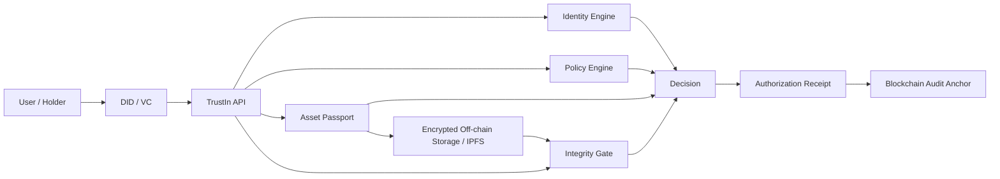

# TrustIn System Architecture

```mermaid
flowchart LR
    U[User / Holder] --> D[DID / VC]
    D --> API[TrustIn API]
    API --> I[Identity Engine]
    API --> P[Policy Engine]
    API --> A[Asset Passport]
    API --> G[Integrity Gate]
    I --> DEC[Decision]
    P --> DEC
    A --> DEC
    G --> DEC
    DEC --> R[Authorization Receipt]
    R --> C[Blockchain Audit Anchor]
    A --> S[Encrypted Off-chain Storage / IPFS]
    S --> G
```

The production implementation is **In Development**. The current root `index.html` demonstrates the intended user flow without claiming live blockchain settlement.
