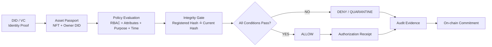
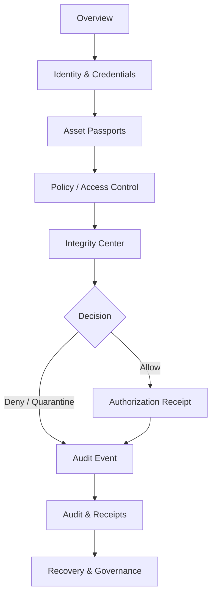

# TrustIn — Dashboard Function Guide

> **TrustIn — Integrity-Gated Asset Passport (IGAP)**  

This document is a **visual companion to the main `README.md`**. It explains what a judge can see inside the TrustIn dashboard, what each screen demonstrates, and how the screens connect into the overall TrustIn workflow.

The prototype is intentionally **offline-friendly and self-contained**. The current dashboard demonstrates the product flow and decision logic visually; production DID/VC cryptography, live smart-contract settlement, persistent storage, ZK proving and hardware attestation remain **In Development**.

---

## 1. TrustIn in one sentence

**TrustIn separates identity, ownership, authorization and asset integrity — then links them into one verifiable decision chain.**

```text
Ownership ≠ Authorization ≠ Integrity
```

An asset can remain owned by its legitimate owner while access is denied because a credential is revoked/expired, the purpose or time window is invalid, or the asset has failed integrity verification.

---

# 2. Overall TrustIn workflow



### Trust decision

```text
Access = Identity Proof
       AND Ownership / Delegation
       AND Policy Permit
       AND Time Validity
       AND Asset Integrity
       AND Credential Status
```

---

# 3. High-level architecture

```text
┌─────────────────────────────────────────────────────────────┐
│                         TRUSTIN                             │
│              Integrity-Gated Asset Passport                │
└─────────────────────────────────────────────────────────────┘
                              │
                              ▼
┌───────────────────┐   ┌────────────────────┐
│ Identity Layer    │   │ Asset Layer        │
│ DID / VC          │   │ NFT Asset Passport │
│ Selective Proof   │   │ Owner DID          │
└─────────┬─────────┘   │ Policy + Integrity │
          │             └─────────┬──────────┘
          └──────────────┬────────┘
                         ▼
                ┌───────────────────┐
                │ Policy Engine     │
                │ RBAC + attributes │
                │ purpose + time    │
                └─────────┬─────────┘
                          ▼
                ┌───────────────────┐
                │ Integrity Gate    │
                │ SHA-256 / attest. │
                └─────────┬─────────┘
                          ▼
                ┌───────────────────┐
                │ Decision Layer    │
                │ ALLOW / DENY      │
                │ QUARANTINE        │
                └─────────┬─────────┘
                          ▼
                ┌───────────────────┐
                │ Evidence Layer    │
                │ Receipt + Audit   │
                │ On-chain anchor   │
                └───────────────────┘
```

---

# 4. Dashboard overview


### What this screen demonstrates

The **Overview** 
The workflow strip makes the complete trust chain visible:

```text
DID / VC proof → Asset ownership → Policy context → Integrity gate → Decision receipt
```

TrustIn is not simply `Wallet → NFT → Access`. It is:

```text
Identity → Ownership → Context → Integrity → Evidence
```

---

# 5. Identity & Credentials


### Purpose

This module represents the **self-sovereign identity layer**:

```text
DID + Verifiable Credential + Role / Attribute + Credential Status
```

The screen demonstrates holder identity, DID, credential type, role, active/revoked status and the concept of selective disclosure.

Example:

```text
Required predicate: role ≥ Auditor
Verifier receives:  ✓ predicate satisfied
Verifier does not need: the holder's complete private attributes
```

### Real implementation — In Development

- W3C DID Core
- Verifiable Credentials 2.0
- issuance / verification
- revocation/status checks
- selective disclosure / ZK adapter

---

# 6. Asset Passports


### Purpose

Every digital or physical asset receives an **Integrity-Gated Asset Passport** binding:

```text
Asset → NFT → Owner DID → Hash / Commitment → Policy → Permissions → Integrity State
```

The NFT is not treated as the entire trust model. TrustIn separates:

```text
Who owns the asset?
        +
Who may use it?
        +
Is it currently trustworthy?
```

### Asset states

```text
UNVERIFIED → ACTIVE → QUARANTINED → REVERIFIED
```

### Real implementation — In Development

- Solidity AssetRegistry
- ERC-721-compatible asset representation
- owner/DID binding
- policy-version references
- delegated permissions
- transfer evidence
- content hash/CID references

---

# 7. Access Control


### Purpose

This screen demonstrates **context-aware authorization** instead of role-only access:

```text
Identity proof       ✓
Ownership/delegation ✓
Role / attribute     ✓
Purpose              ✓
Time window          ✓
Asset integrity      ✓
Credential status    ✓
```

A user can have a valid identity and ownership while still receiving **DENY** when the asset is quarantined or a policy condition fails.

### Real implementation — In Development

- role separation
- RBAC + contextual attributes
- purpose restrictions
- temporal rules
- credential status checks
- authorization decision API
- OPA / Rego policy engine

---

# 8. Integrity Center — core innovation demonstration


The Integrity Center makes the critical failure path observable.

Conceptually:

```text
SHA-256(current) == SHA-256(registered)
```

If the hashes match:

```text
ACTIVE → Integrity PASS → privileged operations remain eligible
```

If they do not:

```text
ACTIVE
  ↓
INTEGRITY FAILURE
  ↓
QUARANTINED
  ↓
PRIVILEGED ACCESS BLOCKED
  ↓
AUDIT EVENT
  ↓
REVERIFY
  ↓
ACTIVE
```

### Judge demonstration

Use **Simulate Tamper** and observe the asset move to `QUARANTINED`. Then use **Reverify Asset** to restore `ACTIVE`.

The important distinction is:

```text
Ownership = still valid
Integrity = failed
Authorization = changed
```

---

# 9. Audit & Authorization Receipts


TrustIn is designed to preserve **decision evidence**, not merely generic event logs.

A conceptual authorization receipt contains:

```text
Subject DID hash
Asset / NFT
Requested purpose
Policy version
Credential status
Integrity state
Timestamp
Decision
Proof / receipt hash
```

Conceptually:

```text
H(DIDh ∥ NFT ∥ PolicyVersion ∥ Integrity ∥ Timestamp ∥ Decision)
```

Instead of only recording `Alice accessed Asset-001`, the receipt can explain which identity proof, asset, policy, purpose, credential state and integrity state produced the decision.

### Real implementation — In Development

- AuthorizationManager
- AuditRegistry
- receipt hashing
- event anchoring
- audit retrieval API
- persistent audit storage

Large files and private credentials remain off-chain; compact commitments are anchored to the blockchain layer.

---

# 10. Recovery & Governance


TrustIn treats operational failure as part of the architecture.

### Threshold recovery

```text
3-of-5 guardians
```

can collectively approve recovery without placing private keys on-chain.

### Role separation

```text
Admin
Minter
Policy Manager
Auditor
Recovery Guardian
```

### Operational risks covered

```text
Private-key loss     → guardian recovery + key rotation
Storage failure      → CID/hash + redundant storage
Credential status    → decision-time verification
Admin abuse          → least privilege + separated roles
ZK complexity        → phased implementation
Legacy IAM           → adapter layer + migration
```

---

# 11. How the dashboard functions connect



The dashboard is one trust-decision pipeline, not a collection of unrelated screens.

---

# 12. End-to-end judge walkthrough

1. **Identity:** open Identity & Credentials and show DID, credential, role and proof concept.
2. **Asset:** open Asset Passports and show NFT, owner DID, hash, policy and integrity state.
3. **Authorization:** open Access Control and show individual policy conditions.
4. **Attack:** open Integrity Center → **Simulate Tamper**.
5. **Quarantine:** show `ACTIVE → INTEGRITY FAILURE → QUARANTINED`.
6. **Denied operation:** return to Access Control and show protected access denied.
7. **Evidence:** open Audit & Receipts and show the decision/evidence record.
8. **Recovery:** reverify the asset and show the state returning to `ACTIVE`.

### The complete story

> **Identity → ownership → authorization → tamper → quarantine → denial → evidence → re-verification.**

---

# 13. TrustIn state machine

```text
                 ┌───────────────┐
                 │   UNVERIFIED  │
                 └───────┬───────┘
                         │ verification
                         ▼
                 ┌───────────────┐
                 │     ACTIVE    │◄──────────────┐
                 └───────┬───────┘               │
                         │                       │
                  hash mismatch              reverify
                         │                       │
                         ▼                       │
                 ┌───────────────┐               │
                 │  QUARANTINED  │───────────────┘
                 └───────┬───────┘
                         │
                         ▼
                privileged access
                     BLOCKED
                         │
                         ▼
                    AUDIT EVENT
```

---

# 14. Data placement model

```text
OFF-CHAIN
────────────────────────────────
PII / credentials / asset files
Digital-twin data / encrypted data
        │
        │ hash / CID / commitment
        ▼
ON-CHAIN
────────────────────────────────
Ownership / roles / policy version
Integrity commitment / decision commitment
Audit anchor
```

This keeps sensitive or large payloads away from the blockchain while retaining verifiable commitments.

---

# 15. Technology architecture

```text
Frontend
React · Vite · TypeScript
        │
API / Application
Node.js · NestJS / Express
        │
 ┌──────┴───────┐
 ▼              ▼
Policy        Identity
OPA/Rego      DID / VC
 └──────┬───────┘
        ▼
Trust Decision
        │
 ┌──────┴─────────┐
 ▼                ▼
Integrity        Asset
SHA-256          Solidity / NFT
Attestation      OpenZeppelin
 └──────┬─────────┘
        ▼
Evidence
Receipt + Audit
        │
        ▼
EVM / Blockchain
```

Open-source-first stack: W3C DID Core, VC 2.0, Solidity, OpenZeppelin, Foundry/Anvil, React, Vite, TypeScript, Node.js, OPA/Rego, PostgreSQL, IPFS/Kubo, SpruceID SSI or current walt.id tooling, Noir/Circom + snarkjs, Slither, Echidna, Docker and GitHub Actions.

---

# 16. Current prototype vs. real implementation

| Capability | Current demo | Real implementation |
|---|---|---|
| Dashboard navigation | **Implemented** | React application |
| Identity UI | **Implemented / simulated** | DID + VC cryptography |
| Asset Passport UI | **Implemented / simulated** | Solidity AssetRegistry |
| RBAC/context checks | **Demo logic** | OPA/Rego + backend policy |
| Integrity comparison | **Interactive simulation** | Real hashing / attestation |
| Quarantine transition | **Interactive** | Contract/state enforcement |
| Authorization receipt | **Demo representation** | Cryptographic receipt + anchor |
| Audit UI | **Implemented / simulated** | Persistent audit/event index |
| Threshold recovery | **UI simulation** | Multisig/guardian workflow |
| ZK proof | **Concept represented** | ZK circuit + verifier |
| IPFS | **Architecture planned** | Kubo / CID / persistence |
| Hardware attestation | **Architecture planned** | NFC / TPM / secure-device integration |

**Important:** simulated browser interactions are not presented as production blockchain execution. Production modules are explicitly **In Development**.

---

# 17. Why the prototype is useful for judging

The dashboard makes the key architectural distinction visible:

```text
VALID IDENTITY
      +
VALID OWNERSHIP
      +
VALID POLICY
      +
VALID INTEGRITY
      ↓
ALLOW
```

versus:

```text
VALID IDENTITY
      +
VALID OWNERSHIP
      +
FAILED INTEGRITY
      ↓
QUARANTINE
      ↓
DENY
      ↓
AUDIT
```

This demonstrates the **behavioral consequence** of the TrustIn architecture instead of only displaying static blockchain objects.

---

# 18. Repository relationship

```text
TrustIn/
├── README.md
├── readmess.md
├── index.html
├── docs/
│   └── screenshots/
│       ├── dashboard.png
│       ├── identity.png
│       ├── assets.png
│       ├── access.png
│       ├── integrity.png
│       ├── audit.png
│       └── recovery.png
├── contracts/       # In Development
├── identity/        # In Development
├── policy/          # In Development
├── integrity/       # In Development
├── zk/              # In Development
├── storage/         # In Development
└── tests/           # In Development
```

See the main [`README.md`](README.md) for the complete problem-statement mapping, research basis, innovation positioning, architecture, technology stack, implementation status and development roadmap.

---

## SIH 2026

**Problem Statement:** 26125  
**Theme:** Blockchain & Cybersecurity  
**Project:** TrustIn — Integrity-Gated Asset Passport  
